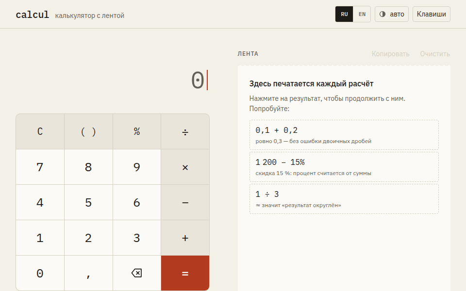
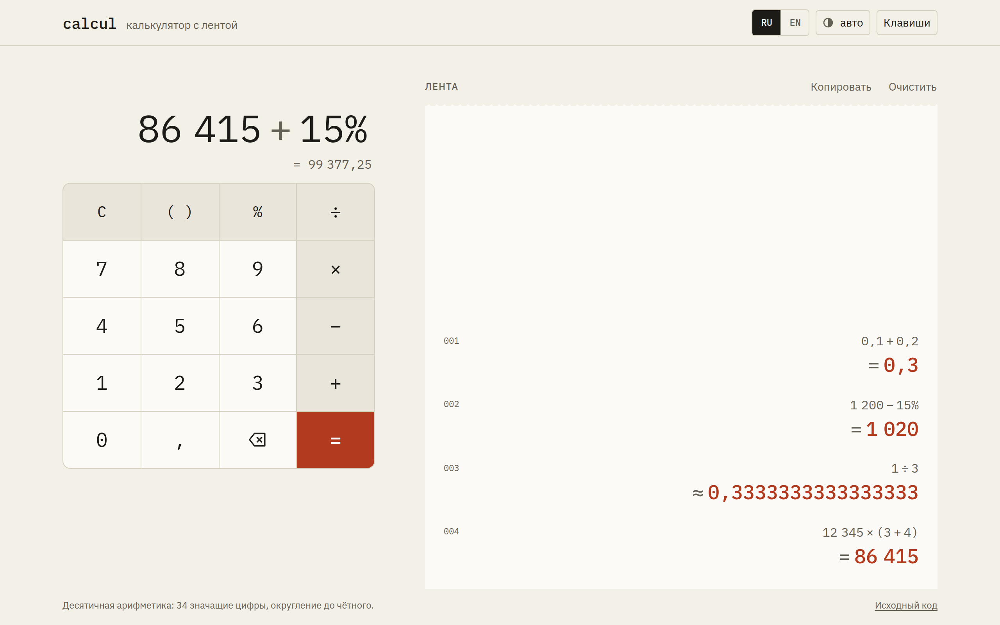
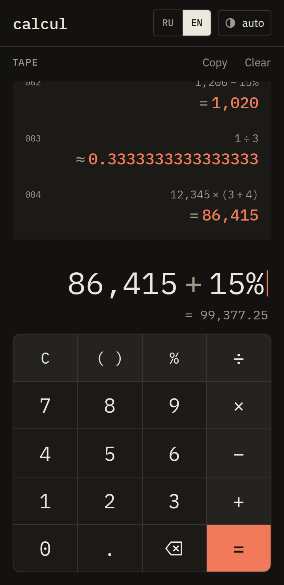
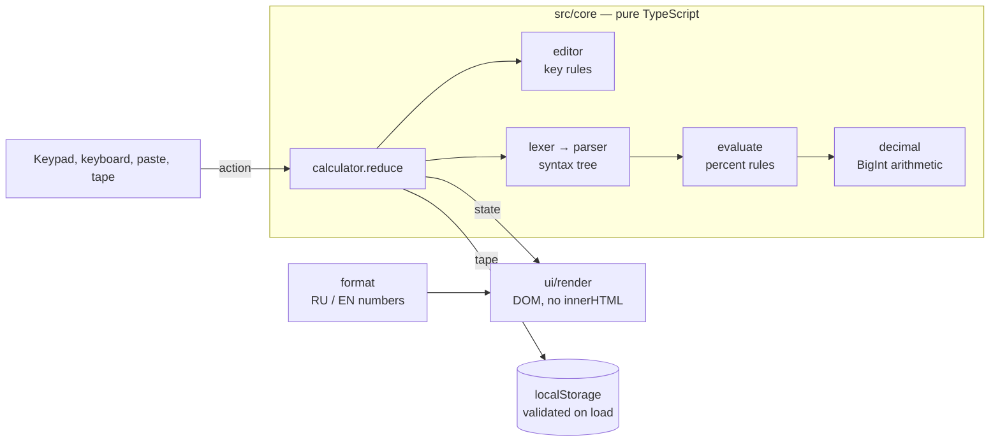
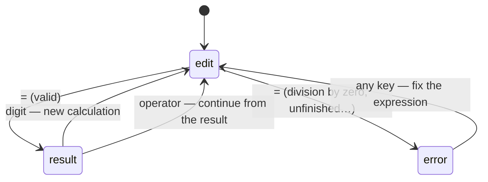

# calcul

**A calculator that gets decimals right and prints every calculation on a paper tape you can reuse.**

[Live demo](https://meewe123.github.io/calcul/) · [Русская версия](README.ru.md) · [Design notes](docs/DESIGN.md) · [Changelog](CHANGELOG.md)

[](https://github.com/Meewe123/calcul/actions/workflows/ci.yml)



## Why

Most web calculators are a thin layer over JavaScript numbers, and it shows:

- `0.1 + 0.2` is `0.30000000000000004` in binary floating point. Calculators hide it by rounding the display, which also hides real digits: the [first version of this project](AUDIT.md) answered `123456789012345 + 1 = 123456789012000`.
- `200 + 10%` gives `200.1` in many of them, while a person means `220`.
- The result disappears as soon as you type the next number.

calcul does decimal arithmetic exactly. It says when a result had to be rounded, and it keeps a tape: every calculation is printed in a numbered list, like on an adding machine. Press any result on the tape to continue from it.

## Features

- **Exact decimal arithmetic** with 34 significant digits. `0.1 + 0.2 = 0.3`, and long numbers keep every digit.
- **Honest rounding.** Rounded results get `≈` instead of `=`. That includes results computed from an earlier rounded value.
- **Expressions** with operator precedence, parentheses (closed for you if you forget) and unary minus.
- **Percentages the way people use them.** `1200 − 15% = 1020` and `200 × 10% = 20`.
- **The tape.** Numbered entries, newest at the bottom, saved in the browser. Press an entry to reuse its result, copy the whole tape as text, or clear it with undo.
- **Errors that help.** `10 ÷ 0` keeps the expression, underlines the zero and says what is wrong. Backspace fixes it.
- **Live preview** of the result while you type.
- **Keyboard first**, with a list of shortcuts. Ctrl+C copies the result, Ctrl+V pastes an expression, and browser shortcuts such as zoom are left alone.
- **Russian and English**, chosen from the browser and switchable. Numbers follow the locale: `1 234,5` / `1,234.5`.
- **Light and dark theme**, following the system or set by hand.
- **Works on a 360px phone.** The keypad sits within thumb reach and the tape fills the space above it.

<p>
  
  
</p>

## How it works

### Exact decimals on BigInt

A number is stored as `coefficient × 10^exponent`, with the coefficient as a `BigInt` (`src/core/decimal.ts`). Addition, subtraction and multiplication work on whole numbers, so they are exact. Division scales the dividend until the quotient has 35 digits. The remainder then decides the rounding: half to even, as in IEEE 754 decimal128, which also sets the 34-digit precision.

Each value carries an `exact` flag. Rounding clears it, and so does any operation with a rounded operand. The interface shows `≈` whenever the flag is cleared or the display had to drop digits.

Property-based tests (fast-check) check the arithmetic against plain `BigInt` math and check that `a + b − b = a` exactly. They also prove that every quotient is correctly rounded: `|a − q·b| ≤ ½ ulp(q) · |b|`.

### Parsing

The lexer turns text into tokens with source positions. A recursive-descent parser builds a syntax tree with this grammar:

```
expression := term (('+' | '−') term)*
term       := unary (('×' | '÷') unary)*
unary      := '−' unary | postfix
postfix    := primary '%'*
primary    := number | '(' expression ')'
```

Parentheses stay in the tree as `group` nodes, because they change how `%` reads: `200 + 10%` is 220, `200 + (10%)` is 200.1. Errors carry the span of the offending token, so the display can underline it.

### Editing

Keys never edit text directly. They go through `src/core/editor.ts`, which keeps the expression well-formed while you type. No leading zeros, one decimal point per number, an operator replaces the previous one, `×` then `−` starts a negative factor, and `2(3)` becomes `2 × (3)`. Pasted text is replayed as key presses, so it follows the same rules.

### Architecture

The calculator is a pure state machine: `reduce(state, action) → state`. It has no DOM and no storage, and it is covered by unit tests. The UI layer only turns events into actions and states into DOM.





## Tech stack

| Area     | Choice                                       | Why                                                                                         |
| -------- | -------------------------------------------- | ------------------------------------------------------------------------------------------- |
| Language | TypeScript, strict, no `any`                 | The core is all edge cases; types keep them visible                                         |
| UI       | Plain DOM, no framework                      | Twenty buttons and a list. 12 KB of JavaScript (gzip) loads faster than any framework would |
| Build    | Vite                                         | Fast dev server, hashed assets, multi-page build for the 404 page                           |
| Fonts    | IBM Plex Mono and Sans, self-hosted          | Monospaced digits for a printing machine; Latin and Cyrillic subsets only                   |
| Tests    | Vitest, fast-check, Playwright, axe-core     | Unit and property tests for the core; real browsers and accessibility checks for the UI     |
| Quality  | ESLint (type-aware), Prettier, Lighthouse CI | Run on every push                                                                           |
| Hosting  | GitHub Pages via GitHub Actions              | Static files, deployed only when all checks pass                                            |

## Quality

These are enforced in CI, not just measured once:

- **Unit tests** for the whole core. CI fails if line coverage of `src/core` drops below 95%; it is 99% at the time of writing.
- **Browser tests** in Chromium on a desktop window and a 360px phone. They cover every feature above plus the bugs from the audit. A test fails if the page logs any console error, which also catches Content Security Policy violations.
- **Accessibility**: axe checks WCAG 2.2 AA and best practices in the light, dark, English, error and dialog states. All text meets 4.5:1 contrast (values in [docs/DESIGN.md](docs/DESIGN.md)).
- **Lighthouse** must score 90+ in every category. Locally, at the time of writing, it scores 100 in performance, accessibility, best practices and SEO on both the mobile and desktop presets.
- **Security**: no secrets exist or are needed; the page has a strict Content Security Policy (inline scripts allowed only by hash); the DOM is built without `innerHTML`; stored data is validated before use; production dependencies are audited in CI and Dependabot keeps everything current.

## Getting started

You need Node.js 22.12 or newer.

```bash
npm ci
npm run dev        # http://localhost:5173
```

Other commands:

| Command                 | What it does                                                     |
| ----------------------- | ---------------------------------------------------------------- |
| `npm test`              | Unit and property tests                                          |
| `npm run test:coverage` | The same, with a coverage report and thresholds                  |
| `npm run test:e2e`      | Browser tests. Run `npx playwright install chromium` once before |
| `npm run check`         | Types, lint, formatting and unit tests in one go                 |
| `npm run build`         | Production build in `dist/`                                      |
| `npm run preview`       | Serves `dist/` the way GitHub Pages does, 404 page included      |
| `npm run screenshots`   | Regenerates the images in this README from a real session        |
| `npm run images`        | Regenerates icons and the Open Graph preview                     |

Build settings, all optional, are described in [.env.example](.env.example). Nothing in this project is secret.

## Keyboard

| Keys                | Action                       |
| ------------------- | ---------------------------- |
| `0`–`9`, `.` or `,` | Digits and decimal separator |
| `+` `-` `*` `/`     | Operations                   |
| `(` `)` `%`         | Parentheses and percent      |
| `Enter` or `=`      | Calculate                    |
| `Backspace`         | Delete the last character    |
| `Esc` or `Delete`   | Clear the expression         |
| `Ctrl+C` / `⌘C`     | Copy the result              |
| `Ctrl+V` / `⌘V`     | Paste an expression          |

## Project structure

```
src/
  core/              Pure logic, no DOM. Every file has a .test.ts next to it.
    decimal.ts       Exact decimal arithmetic on BigInt
    lexer.ts         Text → tokens with positions
    parser.ts        Tokens → syntax tree (recursive descent)
    evaluate.ts      Syntax tree → value, percent rules
    editor.ts        Rules for every key while typing
    paste.ts         Pasted text → key presses
    format.ts        Numbers and expressions for people, RU and EN
    calculator.ts    The state machine: reduce(state, action)
    tape.ts          Saving, loading, copying the tape
  ui/                The page: events → actions, state → DOM
  styles/            Design tokens and components in plain CSS
  main.ts            Entry point
e2e/                 Browser and accessibility tests
scripts/             Image and screenshot generators
docs/                Design notes and screenshots
index.html, 404.html Pages, static markup in Russian, translated on load
```

## Limitations

Deliberate choices and known gaps:

- You type at the end of the expression. There is no cursor for editing in the middle, but backspace, paste and reusing tape results cover most fixes.
- No powers, roots or memory keys. The tape replaces memory, and the rest is out of scope for an everyday calculator.
- The tape lives in this browser only (up to 500 entries) and is not synced anywhere.
- Values are limited to 34 significant digits and exponents of ±9999. Larger values give an "overflow" error, and smaller ones become an approximate zero.

## License

[MIT](LICENSE)
