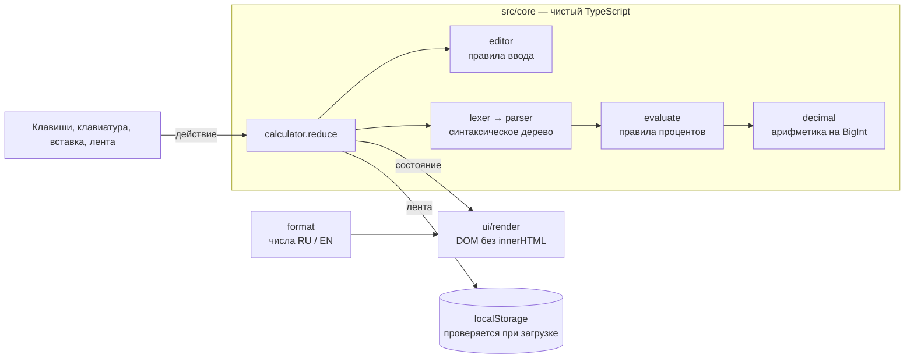
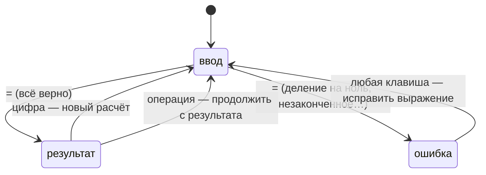

# calcul

**Калькулятор, который считает десятичные дроби без ошибок и печатает каждый расчёт на ленту, к которой можно вернуться.**

[Открыть](https://meewe123.github.io/calcul/) · [English](README.md) · [Дизайн (англ.)](docs/DESIGN.md) · [История изменений](CHANGELOG.md)

[](https://github.com/Meewe123/calcul/actions/workflows/ci.yml)


## Зачем

Большинство веб-калькуляторов — тонкая обёртка над числами JavaScript, и это заметно:

- `0,1 + 0,2` в двоичной арифметике — `0,30000000000000004`. Калькуляторы прячут это округлением на экране и вместе с ним прячут настоящие цифры. [Первая версия этого проекта](AUDIT.md) отвечала `123456789012345 + 1 = 123456789012000`.
- `200 + 10%` во многих из них — `200,1`, хотя человек имеет в виду `220`.
- Результат исчезает, как только начинаешь вводить следующее число.

calcul считает десятичные дроби точно и говорит, когда результат пришлось округлить. Каждый расчёт он печатает на ленту с номерами, как арифмометр. Нажмите на любой результат на ленте, чтобы продолжить с ним.

## Возможности

- **Точная десятичная арифметика**, 34 значащие цифры. `0,1 + 0,2 = 0,3`, длинные числа не теряют ни одной цифры.
- **Честное округление.** У округлённого результата вместо `=` стоит `≈`. Это касается и результатов, посчитанных из уже округлённого числа.
- **Выражения**: приоритет операций, скобки (незакрытые закроются сами), унарный минус.
- **Проценты, как их понимают люди.** `1200 − 15% = 1020`, а `200 × 10% = 20`.
- **Лента.** Пронумерованные записи, новая — внизу, сохраняются в браузере. Нажмите на запись — её результат попадёт в выражение. Ленту можно скопировать текстом или очистить с возможностью вернуть.
- **Ошибки, которые помогают.** `10 ÷ 0` не стирает выражение: ноль подчёркнут, рядом написано, что не так. Исправляется одной клавишей «стереть».
- **Живой предпросмотр** результата во время ввода.
- **Удобно с клавиатуры**, есть справка по клавишам. Ctrl+C копирует результат, Ctrl+V вставляет выражение. Браузерные сочетания вроде масштаба калькулятор не перехватывает.
- **Русский и английский**: язык берётся из браузера, его можно переключить. Числа пишутся по правилам языка: `1 234,5` / `1,234.5`.
- **Светлая и тёмная тема**: как в системе или на выбор.
- **Работает на телефоне от 360 px**: клавиатура под большим пальцем, лента занимает место над ней.

<p>
  
  
</p>

## Как это устроено

### Точные десятичные числа на BigInt

Число хранится как `коэффициент × 10^порядок`, коэффициент — `BigInt` (`src/core/decimal.ts`). Сложение, вычитание и умножение работают с целыми числами, поэтому точны. При делении делимое домножается так, чтобы в частном было не меньше 35 цифр, а остаток решает, куда округлять. Округление идёт до чётного, как в IEEE 754 decimal128; оттуда же точность в 34 цифры.

У каждого значения есть флаг `exact`. Округление его снимает, и любая операция с неточным операндом тоже. Интерфейс ставит `≈`, если флаг снят или на экране пришлось отбросить цифры.

Тесты на свойства (fast-check) сверяют арифметику с обычной `BigInt`-математикой и проверяют, что `a + b − b = a` ровно. Ещё они доказывают, что каждое частное округлено правильно: `|a − q·b| ≤ ½ ulp(q) · |b|`.

### Разбор выражений

Лексер превращает текст в токены с позициями в исходной строке. Парсер — рекурсивный спуск по такой грамматике:

```
выражение := слагаемое (('+' | '−') слагаемое)*
слагаемое := унарное (('×' | '÷') унарное)*
унарное   := '−' унарное | постфикс
постфикс  := первичное '%'*
первичное := число | '(' выражение ')'
```

Скобки остаются в дереве отдельными узлами `group`, потому что меняют смысл `%`: `200 + 10%` — это 220, а `200 + (10%)` — 200,1. Ошибка хранит позицию токена, на котором споткнулся парсер, поэтому табло может его подчеркнуть.

### Ввод

Клавиши не редактируют текст напрямую. Каждая проходит через правила в `src/core/editor.ts`, и выражение всегда остаётся корректным. Нет ведущих нулей, в числе одна запятая, новая операция заменяет предыдущую, `×` и затем `−` начинают отрицательный множитель, `2(3)` превращается в `2 × (3)`. Вставленный текст «проигрывается» как нажатия клавиш, поэтому подчиняется тем же правилам.

### Архитектура

Калькулятор — чистая машина состояний: `reduce(состояние, действие) → состояние`. Ни DOM, ни хранилища в ядре нет, и оно целиком покрыто модульными тестами. Слой интерфейса только превращает события в действия, а состояния — в DOM.





## Технологии

| Что       | Выбор                                    | Почему                                                                                 |
| --------- | ---------------------------------------- | -------------------------------------------------------------------------------------- |
| Язык      | TypeScript в строгом режиме              | Ядро состоит из крайних случаев, типы держат их на виду                                |
| Интерфейс | Обычный DOM, без фреймворка              | Двадцать кнопок и список. 12 КБ JavaScript (gzip) грузятся быстрее любого фреймворка   |
| Сборка    | Vite                                     | Быстрый dev-сервер, хеши в именах файлов, отдельная страница 404                       |
| Шрифты    | IBM Plex Mono и Sans, со своего сервера  | Моноширинные цифры для «печатающей машинки»; только латиница и кириллица               |
| Тесты     | Vitest, fast-check, Playwright, axe-core | Модульные тесты и тесты на свойства для ядра; настоящий браузер и проверка доступности |
| Качество  | ESLint с типами, Prettier, Lighthouse CI | Запускаются на каждый push                                                             |
| Хостинг   | GitHub Pages через GitHub Actions        | Статические файлы, публикуются только если все проверки прошли                         |

## Качество

Всё это проверяется в CI на каждый push, а не измерено один раз:

- **Модульные тесты** на всё ядро. CI падает, если покрытие строк `src/core` ниже 95%; сейчас оно 99%.
- **Браузерные тесты** в Chromium: окно компьютера и телефон шириной 360 px. Покрыты все возможности выше и баги из аудита. Любая ошибка в консоли роняет тест, поэтому нарушения политики безопасности контента (CSP) тоже ловятся.
- **Доступность**: axe проверяет WCAG 2.2 AA и рекомендации в светлой и тёмной теме, на английском, в состоянии ошибки и с открытым диалогом. Контраст всего текста — не ниже 4,5 : 1 (значения в [docs/DESIGN.md](docs/DESIGN.md)).
- **Lighthouse** должен давать 90+ по каждой категории. Сейчас локально — 100 по производительности, доступности, лучшим практикам и SEO, и на мобильном, и на десктопном профиле.
- **Безопасность**: секретов нет и они не нужны; строгая CSP (встроенный скрипт разрешён только по хешу); DOM строится без `innerHTML`; сохранённые данные проверяются перед использованием; зависимости проверяет `npm audit` в CI, обновления присылает Dependabot.

## Запуск

Нужен Node.js 22.12 или новее.

```bash
npm ci
npm run dev        # http://localhost:5173
```

Остальные команды:

| Команда                 | Что делает                                                                 |
| ----------------------- | -------------------------------------------------------------------------- |
| `npm test`              | Модульные тесты и тесты на свойства                                        |
| `npm run test:coverage` | То же с отчётом о покрытии и порогами                                      |
| `npm run test:e2e`      | Браузерные тесты. Перед первым запуском: `npx playwright install chromium` |
| `npm run check`         | Типы, линтер, форматирование и модульные тесты разом                       |
| `npm run build`         | Сборка в `dist/`                                                           |
| `npm run preview`       | Отдаёт `dist/` так же, как GitHub Pages, вместе со страницей 404           |
| `npm run screenshots`   | Пересоздаёт картинки для README из настоящего сеанса                       |
| `npm run images`        | Пересоздаёт иконки и картинку для превью ссылок                            |

Настройки сборки описаны в [.env.example](.env.example), все необязательные. Секретов в проекте нет.

## Клавиши

| Клавиши              | Действие                   |
| -------------------- | -------------------------- |
| `0`–`9`, `,` или `.` | Цифры и десятичная запятая |
| `+` `-` `*` `/`      | Действия                   |
| `(` `)` `%`          | Скобки и процент           |
| `Enter` или `=`      | Посчитать                  |
| `Backspace`          | Стереть последний знак     |
| `Esc` или `Delete`   | Сбросить выражение         |
| `Ctrl+C` / `⌘C`      | Скопировать результат      |
| `Ctrl+V` / `⌘V`      | Вставить выражение         |

## Структура

```
src/
  core/              Логика без DOM. Рядом с каждым файлом — .test.ts.
    decimal.ts       Точная десятичная арифметика на BigInt
    lexer.ts         Текст → токены с позициями
    parser.ts        Токены → синтаксическое дерево (рекурсивный спуск)
    evaluate.ts      Дерево → значение, правила процентов
    editor.ts        Правила для каждой клавиши при вводе
    paste.ts         Вставленный текст → нажатия клавиш
    format.ts        Числа и выражения для людей, RU и EN
    calculator.ts    Машина состояний: reduce(состояние, действие)
    tape.ts          Сохранение, загрузка и копирование ленты
  ui/                Страница: события → действия, состояние → DOM
  styles/            Дизайн-токены и компоненты на обычном CSS
  main.ts            Точка входа
e2e/                 Браузерные тесты и проверки доступности
scripts/             Генераторы картинок и скриншотов
docs/                Заметки о дизайне и скриншоты
index.html, 404.html Страницы: разметка на русском, перевод — при загрузке
```

## Ограничения

Сознательные решения и известные пробелы:

- Ввод идёт в конец выражения: курсора для правки в середине нет. Большинство исправлений закрывают «стереть», вставка и повторное использование результатов с ленты.
- Нет степеней, корней и клавиш памяти. Память заменяет лента, остальное выходит за рамки калькулятора на каждый день.
- Лента хранится только в этом браузере (до 500 записей) и никуда не синхронизируется.
- Значения ограничены 34 значащими цифрами и порядком ±9999. Большие числа дают ошибку «слишком большое», меньшие превращаются в приближённый ноль.

## Лицензия

[MIT](LICENSE)
